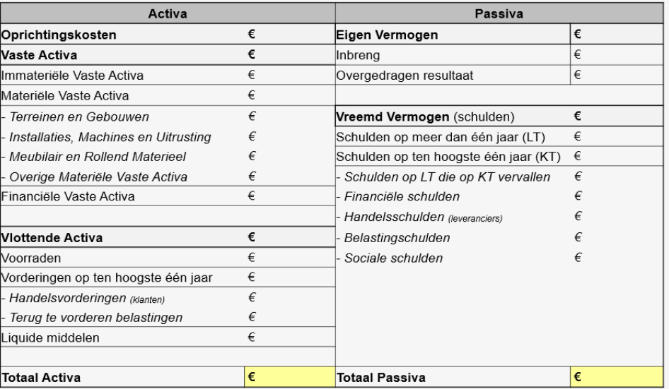

# De Balans

## 1. Opbouw van de Balans

Een balans is een momentopname van de bezittingen (activa) en schulden (passiva) van een onderneming. Het laat niet direct de winstgevendheid van een onderneming zien, maar toont waar de middelen vandaan komen en hoe deze worden ingezet. Activa zijn de werkmiddelen, terwijl passiva verwijzen naar de financiering van deze middelen. De balans bestaat uit een actieve zijde (activa) en een passieve zijde (passiva), en is altijd in evenwicht.

Vergelijkbaar met een jaarlijkse familiefoto, biedt de balans inzicht in de veranderingen in een onderneming door de jaren heen, zonder expliciet uit te leggen wat deze veranderingen zijn. Dit vereist analyse om te begrijpen wat er veranderd is en waarom.

### 1.1 Activa

**Oprichtingskosten:** Dit zijn kosten gemaakt bij de oprichting van een onderneming, zoals notariskosten en het activeren van een btw-nummer. Hoewel kosten normaal in de resultatenrekening worden opgenomen, mogen oprichtingskosten ook op de balans worden gezet en over meerdere jaren worden afgeschreven.

**Vaste Activa:** Dit zijn werkmiddelen die voor langere tijd (minimaal een jaar) in de onderneming blijven, zoals materiële vaste activa (gebouwen, machines) en immateriële vaste activa (patenten, goodwill). Deze investeringen worden bij aanschaf op de balans gezet tegen aanschafwaarde en elk jaar afgeschreven om hun economische waarde te reflecteren. Ook financiële vaste activa, zoals aandelen in andere bedrijven of huurwaarborgen, vallen hieronder.

**Vlottende Activa:** Dit zijn werkmiddelen die binnen een jaar worden omgezet in geld, zoals voorraden, handelsvorderingen en liquide middelen. Voorraden zijn producten die verkocht moeten worden, handelsvorderingen zijn facturen die nog betaald moeten worden door klanten, en liquide middelen zijn direct beschikbaar geld.

### 1.2 Passiva

De passiefzijde van de balans bestaat uit het eigen vermogen en vreemd vermogen.

**Eigen Vermogen (EV):** Dit is de waarde die door de eigenaars is ingebracht in de onderneming, zoals geld, natuur (gebouwen, machines), knowhow of arbeid. Ook niet-uitgekeerde winst (of verlies) van voorgaande jaren wordt hierop geplaatst. Eigen vermogen is een buffer voor de onderneming en kan als een interne schuld worden beschouwd.

**Vreemd Vermogen (VV) of Schulden:** Dit zijn schulden aan externe partijen, zoals banken. Er zijn twee soorten vreemd vermogen:

- **Schulden op lange termijn (VVLT):** Dit zijn leningen of kredieten die pas na meer dan een jaar terugbetaald moeten worden, zoals hypothecaire leningen of investeringskredieten.
- **Schulden op korte termijn (VVKT):** Dit zijn schulden die binnen een jaar moeten worden terugbetaald, zoals het deel van leningen dat op korte termijn moet worden afgelost of nog niet-betaalde facturen aan leveranciers.

### 1.3 Het Micromodel van de Balans

De balans wordt gepresenteerd in een T-vorm, waarbij activa links en passiva rechts staan. Dit micromodel helpt bij het interpreteren van de financiële situatie van een onderneming. De balans moet altijd in evenwicht zijn, waarbij de totale waarde van de activa gelijk is aan de passiva. Dit weerspiegelt dat alles wat een onderneming bezit, gefinancierd moet worden door eigen of vreemd vermogen.

Door de balans over meerdere jaren te bekijken, kunnen veranderingen in de onderneming worden waargenomen en geïnterpreteerd. Bijvoorbeeld een stijging in schulden kan wijzen op extra geleend kapitaal, terwijl een toename van liquide middelen kan betekenen dat de onderneming cash aanhoudt, wellicht door het aangaan van nieuwe leningen.

### 1.4 Van Momentopname naar Momentopname

Doorheen de jaren van beroepsactiviteit is er zeker ook heel veel veranderd binnen de balans: er werden vorderingen en schulden gecreëerd (aangekocht of verkocht op factuur), facturen werden betaald (liquide middelen wijzigen), er werd geïnvesteerd (nieuwe vaste activa) of nieuwe schulden aangegaan (vreemd vermogen). Bij elke verandering doorheen het jaar zal via het systeem van dubbel boekhouden (waar komen de middelen vandaan en waar gaan ze naartoe) een garantie ontstaan dat actief = passief.

Deze cursus heeft niet als doel om boekhoudkundige transacties zelf te gaan opstellen, maar het is wel van belang dat er inzicht wordt gegeven in de elementaire “communicerende vaten” van de balans. We verduidelijken de werking openingsbalans naar toekomstige geprojecteerde balansen met enkele voorbeelden.

Stel dat dit jouw stappenplan is als ondernemer:

1. Je schrijft 10 000,00 € van je privéspaarrekening over naar deze van je onderneming bij de opstart van je zelfstandige zaak (vennootschap – bv);
2. Je besluit ook om een geërfd stuk grond t.w.v. 17 000,00 € in te brengen in de onderneming (waarde na attest revisor);
3. Je koopt een laptop van 1 000,00 € aan (zonder rekening te houden met btw) en zal deze factuur binnen een maand vereffenen;
4. Je koopt een lichte vrachtwagen t.w.v. 20 000,00 € (we houden geen rekening met de btw). Hiervoor ga je een lening aan van 12 000,00 € (over 4 jaar terug te betalen + 3% interest). Het resterend bedrag wordt onmiddellijk betaald via de bankrekening.

Elke van bovenstaande transacties genereert een “balansbeweging” waardoor er een nieuwe balans ontstaat. Hoewel je in realiteit nooit bij elke factuur of betaling een nieuwe balans zal opstellen, is dit wel wat er achterliggend gebeurt in een boekhoudpakket.

We gaan in deze oefening transactie per transactie bespreken om na te gaan wat er in de balans wijzigt en waarom. Merk op: deze ondernemer is nog niet begonnen met zijn ondernemersactiviteit (geen aan- en verkopen met de bedoeling winst te maken).

**Stappenplan:**

1. Je schrijft 10 000,00 € van je privéspaarrekening over naar deze van je onderneming bij de opstart van je zelfstandige zaak (vennootschap – bv).

   - Aan de actiefzijde zijn er nieuwe werkmiddelen: er is 10 000,00 € die de vennootschap vanaf heden kan gebruiken. Aan de passiefzijde hebben we een inbreng van hetzelfde bedrag: als men morgen deze zaak zou stopzetten, zal de eigenaar zijn 10 000,00 € terugvragen.
   - **Conclusie:**
     - Activa: Vlottende activa + 10 000,00 €
     - Passiva: Eigen vermogen + 10 000,00 €
     - **A = P**

2. Je besluit ook om een geërfd stuk grond t.w.v. 17 000,00 € in te brengen in de onderneming (waarde na attest revisor);
   - Ditmaal is er ook een werkmiddel in de onderneming ondergebracht dat opnieuw niet is gefinancierd met externe schulden. Dit keer is het echter een investering die we meerdere jaren van plan zijn te gebruiken. De inbreng stijgt tot 27 000,00 €. Als deze onderneming zijn zaak nu wil verkopen, zal hij hiervoor minstens dit bedrag eisen van de overnemer.
   - **Conclusie:**
     - Activa: Vaste activa + 17 000,00 €
     - Passiva: Eigen vermogen + 17 000,00 €
     - **A = P**

3. Je koopt een laptop van 1 000,00 € aan (zonder rekening te houden met btw) en zal deze factuur binnen een maand vereffenen;
   - Aan de kant van de werkmiddelen ontstaat het meest logische: een nieuwe investering. Echter, deze is nog niet betaald dus we kunnen de liquide middelen niet laten afnemen. De factuur aan onze leverancier (verkoper) dient nog te worden betaald. Er is met andere woorden nog een handelsschuld. Hoewel er hier geen termijn wordt gegeven, gaan we er altijd vanuit dat een handelsschuld op korte termijn dient betaald te worden (binnen het jaar).
   - **Conclusie:**
     - Activa: Vaste activa + 1 000,00 €
     - Passiva: Vreemd vermogen + 1 000,00 €
     - **A = P**

4. Je koopt een lichte vrachtwagen t.w.v. 20 000,00 € (we houden geen rekening met de btw). Hiervoor ga je een lening aan van 12 000,00 € (over 4 jaar gelijk terug te betalen + 3% interest). Het resterend bedrag wordt onmiddellijk betaald via de bankrekening.
   - De laatste transactie heeft de meeste voeten in de aarde om op te lossen. Ga hier stapsgewijs te werk. Allereerste is de werkmiddelenkant het meest logische: er komt een wagen bij met een waarde van 20 000,00 €.
   - Echter, er gebeurt nog wat aan de actiefzijde. We zullen deze wagen deels zelf gaan financieren. Onze eigen liquide middelen worden verminderd met 8 000,00 EUR (het bedrag dat we zelf neerleggen). Dit zorgt ervoor dat de actiefzijde stijgt met 12 000,00 € (+ 20 000,00 € wagen en – 8 000,00 € voor de eigen betaalde liquide middelen).
   - Aan de passiefzijde zullen we dus ook met

 12 000,00 € aan vreemd vermogen moeten verhogen. Dit is het bedrag dat hier wordt geleend via een investeringskrediet. We weten dat dit krediet over 4 jaar zal worden terugbetaald via constante kapitaalaflossingen en dat het hier gaat over vreemd vermogen. De opmerking die we hier echter bij moeten maken is dat niet het volledige bedrag bij “vreemd vermogen op lange termijn” mag komen. Immers, we zullen hier binnen het jaar reeds 1/4e van aflossen (= 3 000,00 €).

- Tot slot is het aspect interest natuurlijk niet onbelangrijk maar niet van belang in het verhaal van de balans (bezittingen/schulden) aangezien interest de KOST is die we betalen om te mogen lenen (“geld lenen kost ook geld”) en dat we kosten enkel terugvinden in de resultatenrekening (zie later).
  - **Conclusie:**
  - Activa: Vaste activa + 20 000,00 €
  - Vlottende activa - 8 000,00 €
  - Passiva: VV op LT + 9 000,00 €
  - VV op KT + 3 000,00 €
  - **A = P**

## 2. Een goede of slechte balans?

In wat hiervoor kwam hebben we gezien hoe een balans is opgebouwd en hoe je zelf kan leren om bepaalde inzichten te krijgen van wat er allemaal speelt in de onderneming op een bepaald moment. Daarnaast kunnen we bij een balans wel een aantal conclusies trekken over het reilen en zeilen van de onderneming.

Bij het bekijken van een balans is het van belang om rekening te houden met twee nieuwe “knipperlichten”. Deze knipperlichten zijn vooral van belang bij het proberen uitkeren van winsten, maar het kan geen kwaad dat we deze ook toelichten samen met de impact ervan.

### Sjabloon Balans

### De liquiditeitstest

De liquiditeitstest is een zeer courant gebruikt instrument om na te gaan of de dagelijkse activiteiten in een onderneming vlot verlopen. Deze test gaat na of een onderneming in staat is om alle verplichtingen aan de schuldeisers op korte termijn te voldoen met de huidige middelen. Het resultaat ervan is ook heel logisch: als een onderneming er niet in slaagt, dan loopt de werknemer, leverancier of kredietverstrekker het risico om niet te worden (terug-)betaald.

We bespreken de meest gangbare berekeningsmethodes:

#### Current Ratio of Liquiditeit in Ruime Zin

De meest elementaire vorm om liquiditeit te berekenen is om te kijken WAARMEE we onze schulden op korte termijn (VVKT) ONMIDDELLIJK kunnen aflossen. Het spreekt voor zich dat we dan kijken naar de vlottende activa. Immers, dit zijn die middelen die in minder dan een jaar in geld kunnen worden omgezet. Ze zijn – theoretisch alvast – de meest liquide actiefbestanddelen.

We kunnen deze elementen snel als volgt berekenen:
\[ \text{Current Ratio} = \frac{\text{Vlottende Activa}}{\text{Schulden op korte termijn}} (> 1) \]
Indien de Current Ratio > 1 kunnen we stellen dat de onderneming liquide is: het vlottend actief is voldoende om de schulden op korte termijn te kunnen aflossen.

#### Quick Ratio of Liquiditeit in Enge Zin

Het verhaal dat we hierboven stellen is echter voor veel ondernemingen te simplistisch. Je kan immers niet van iedere onderneming garanderen dat élk onderdeel van de vlottende activa even liquide (of dus onmiddellijk verkoopbaar) is. Over sommige elementen is er weinig discussie: de liquide middelen zijn onmiddellijk beschikbare geldmiddelen en ook de handelsvorderingen zijn verondersteld om voldoende snel te worden geïnd. Het probleem zit hem eerder bij de voorraden.

Indien de voorraden snel verkoopbaar zijn (bijvoorbeeld verse producten) dan kunnen we inderdaad stellen dat deze liquide zijn en is de current ratio voldoende. Indien de voorraden echter gerust lange tijd zonder bederf in het magazijn kunnen liggen, dan moet je oordelen dat deze dan niet liquide zijn (bijv. sommige materialen uit de bouwsector). In dat geval berekenen we beter een meer veilige vorm van liquiditeit via de “quick ratio”.
\[ \text{Quick Ratio} = \frac{\text{Liquide middelen} + \text{Vorderingen op korte termijn}}{\text{Schulden op korte termijn}} (> 1) \]
Hier dient het resultaat nog steeds > 1 te zijn. We willen immers nog steeds dat deze middelen minstens één keer de schulden op korte termijn kunnen voldoen. Merk op dat dit dus een veiligere berekeningswijze is.

### Impact voor externe stakeholders

Er bestaan applicaties (zoals CompanyWeb of rechtstreeks via NBB) waar je als externe stakeholder kan opzoeken hoe het gesteld is met de liquiditeit van een onderneming op basis van de laatst neergelegde jaarrekeningen. Als externe partner kan je zo makkelijk nagaan of een onderneming de afgelopen jaren een positieve liquiditeit had of niet. Op die manier kun je beslissen om met iemand in zee te gaan of niet.

Hierbij denken we dan bijvoorbeeld aan:

- Een nieuwe leverancier (zullen mijn facturen worden betaald?);
- Een potentiële nieuwe werknemer (zal ik mijn loon wel krijgen?);
- Een bankier (zal een nieuw krediet op wel tijdig worden afgelost op KT?).

### De solvabiliteitstest

Naast de liquiditeitstest kan er ook worden nagegaan of de onderneming kredietwaardig is en, bij uitbreiding, erin slaagt om alle schulden te kunnen terugbetalen in geval van liquidatie (stopzetting). Dit test de zogenaamde solvabiliteit van de onderneming.

#### Financiële onafhankelijkheid

In de meest traditionele betekenis van de solvabiliteit kijken we naar de verhoudingen binnen de passiefzijde van de balans. Hierbij gaan we de financiële draagkracht van de onderneming na.
\[ \text{Financiële onafhankelijkheid} = \frac{\text{Eigen Vermogen}}{\text{Totaal Vermogen}} \times 100\% \]
De solvabiliteit wordt vooral nagegaan bij ondernemingen die op zoek zijn naar externe financieringsmiddelen. De bank kan hierbij zekerheden (“waarborgen”) vragen zoals het vestigen van een hypotheek, het persoonlijke borg staan van de lening of de inpandname van een handelsfonds. Echter, banken zullen willen weten welk engagement de ondernemer zelf aanbiedt en hoeveel eigen middelen reeds beschikbaar zijn.

Een lagere financiële onafhankelijkheidsgraad betekent dat er meer vreemd vermogen is waar interesten (kosten) op moeten worden betaald. Dit zet druk op de winstgevendheid (rendabiliteit) waardoor er minder overblijft om uit te keren aan de aandeelhouders. Bovendien, hoe lager de financiële onafhankelijkheidsgraad, hoe kleiner de kans dat het eigen vermogen zal worden terugbetaald bij stopzetting van de onderneming.

Tot slot geven we nog mee dat de solvabiliteit best in combinatie wordt bekeken met de liquiditeit én rendabiliteit van de onderneming.

Here’s a detailed breakdown for each of the exercises provided.

## 1.3.1. DE BALANS OPSTELLEN

### Oefening 1

**a) Opstellen van de openingsbalans voor Elias:**

| **Activa**                                | **Bedrag (€)**  | **Passiva**                               | **Bedrag (€)** |
|-------------------------------------------|-----------------|-------------------------------------------|-----------------|
| Oprichtingskosten                         | 1 362,00        | Investeringskrediet bestelwagen           | 10 000,00       |
| Aankoop bestelwagen                       | 18 000,00       | Vreemd vermogen op korte termijn           | 0,00            |
| Aankoop werkmateriaal                     | 3 400,00        | Eigen vermogen                            | **15 700,00**   |
| Huurwaarborg magazijn                     | 900,00          |                                           |                 |
| Beginvoorraad mortel                      | 2 400,00        |                                           |                 |
| Liquide middelen                          | 3 938,00        |                                           |                 |
| **Totaal Activa**                        | **30 000,00**   | **Totaal Passiva**                       | **30 000,00**   |

**b) Berekening van de eigen inbreng:**

**Eigen Vermogen = Totaal Activa - Totaal Vreemd Vermogen**  
**Eigen Vermogen = €30 000 - €10 000 = €20 000**

### Oefening 2

**a) Opstellen van de openingsbalans voor Olivia:**

| **Activa**                                | **Bedrag (€)**  | **Passiva**                               | **Bedrag (€)** |
|-------------------------------------------|-----------------|-------------------------------------------|-----------------|
| Oprichtingskosten                         | 1 100,00        | Krediet op afbetaling                     | 4 000,00        |
| Aankoop laptop                            | 1 500,00        |                                           |                 |
| Aankoop software                          | 1 200,00        |                                           |                 |
| Aankoop meubilair en uitrusting          | 1 400,00        |                                           |                 |
| Prestaties nog te ontvangen               | 3 400,00        |                                           |                 |
| Geld op bankrekening                      | 400,00          |                                           |                 |
| **Totaal Activa**                        | **9 000,00**    | **Totaal Passiva**                       | **9 000,00**    |

**b) Berekening van de eigen inbreng:**

**Eigen Vermogen = Totaal Activa - Totaal Vreemd Vermogen**  
**Eigen Vermogen = €9 000 - €4 000 = €5 000**

### Oefening 3

**a) Opstellen van de openingsbalans voor de speechschrijver:**

| **Activa**                                | **Bedrag (€)**  | **Passiva**                               | **Bedrag (€)** |
|-------------------------------------------|-----------------|-------------------------------------------|-----------------|
| Aankoop laptop                            | 1 200,00        | Openstaande schulden                      | 1 100,00        |
| Aankoop meubilair thuisbureau             | 2 700,00        | Sociale zekerheidsbijdragen               | 600,00          |
| Openstaande vorderingen                   | 2 000,00        |                                           |                 |
| Inbreng personenwagen                     | 4 500,00        |                                           |                 |
| Liquide middelen                          | 1 000,00        |                                           |                 |
| **Totaal Activa**                        | **11 400,00**   | **Totaal Passiva**                       | **11 400,00**   |

**b) Berekening van de eigen inbreng:**

**Eigen Vermogen = Totaal Activa - Totaal Vreemd Vermogen**  
**Eigen Vermogen = €11 400 - €1 700 = €9 700**

### Gevraagd 2

**1. Veranderingen binnen de balans:**

1. **Betaling sociale en belastingschulden:**
   - Activa: Liquide middelen ↓
   - Passiva: Sociale zekerheidsbijdragen ↓
   - **A = P**

2. **KT-lening aanvragen:**
   - Activa: Liquide middelen ↑
   - Passiva: Schulden op korte termijn ↑
   - **A = P**

3. **Helft van de vorderingen geïnd:**
   - Activa: Openstaande vorderingen ↓, Liquide middelen ↑
   - **A = P**

4. **Aankoop schrijfsoftware:**
   - Activa: Aankoop software ↑, Liquide middelen ↓
   - Passiva: Krediet op afbetaling ↑
   - **A = P**

5. **Betaling leveranciersschuld:**
   - Activa: Liquide middelen ↓
   - Passiva: Openstaande schulden ↓
   - **A = P**

**Na deze verrichtingen:**

| **Activa**                                | **Bedrag (€)**  | **Passiva**                               | **Bedrag (€)** |
|-------------------------------------------|-----------------|-------------------------------------------|-----------------|
| Aankoop laptop                            | 1 500,00        | Openstaande schulden                      | 0,00            |
| Aankoop software                          | 1 200,00        | Sociale zekerheidsbijdragen               | 0,00            |
| Aankoop meubilair                         | 1 400,00        |                                           |                 |
| Openstaande vorderingen                   | 1 000,00        |                                           |                 |
| Liquide middelen                          | 1 500,00        |                                           |                 |
| **Totaal Activa**                        | **10 000,00**   | **Totaal Passiva**                       | **10 000,00**   |

### Oefening 4

**a) Opstellen van de eindbalans voor Raf:**

| **Activa**                                | **Bedrag (€)**  | **Passiva**                               | **Bedrag (€)** |
|-------------------------------------------|-----------------|-------------------------------------------|-----------------|
| Huidige waarde installaties                | 7 200,00        | Lening voor frituurbarak                  | 60 000,00       |
| Huidige waarde frituurbarak               | 80 000,00       | Openstaande leveranciersschulden          | 3 500,00        |
| Voorraad frituursnacks en frieten        | 2 400,00        | Sociale zekerheidsbijdragen               | 700,00          |
| Openstaande handelsvorderingen            | 5 000,00        |                                           |                 |
| Huidige waarde bestelwagen                | 14 400,00       |                                           |                 |
| Liquide middelen                          | 6 200,00        |                                           |                 |
| Gerealiseerde overgedragen winst          | 11 400,00       |                                           |                 |
| **Totaal Activa**                        | **126 600,00**  | **Totaal Passiva**                       | **126 600,00**  |

**b) Berekening van de eigen inbreng:**

**Eigen Vermogen = Totaal Activa - Totaal Vreemd Vermogen**  
**Eigen Vermogen = €126 600 - €63 500 = €63 100**

---

## 1.3.2. BALANSANALYSE

### Oef 1

**1. Beoordeel onderstaande stellingen:**

- **Deze onderneming bezit andere ondernemingen:**
  - **Fout** - Geen bewijs in de balans.

- **Er werd vorig jaar geen winst gemaakt:**
  - **Fout** - Moet worden bevestigd door de resultatenrekening.

- **Er werd het afgelopen boekjaar extra geleend:**
  - **Juist** - Op basis van de balans is er een toename in vreemd vermogen.

**2. Liquiditeitstest:**

- **Current Ratio = Vlottende Activa / Kortlopende Schulden** (moet > 1 zijn).
- Verklaring: als de ratio groter is dan 1, dan is de onderneming in staat om haar kortlopende verplichtingen te voldoen.

**3. Kredietwaardigheid:**

- **Financiële onafhankelijkheid = Eigen Vermogen / Totaal Vermogen × 100%**.
- Een percentage onder 50% duidt op een hogere afhankelijkheid van vreemd vermogen.

### Oef 2

**1. Duid de correcte stelling aan:**

- **Er werd voor de winkels een huurwaarborg betaald:** **Juist**
- **Er was afgelopen jaar met zekerheid in het ganse boekjaar een totaal verlies van 126 748 €:** **Fout**
- **Er werd dit boekjaar voor 90 620 € aan goederen uit voorraad verkocht:** **Juist**
- **Deze onderneming belegt op korte termijn:** **Fout**
- **Deze onderneming is dit jaar minder waard geworden:** **Juist**
- **Er wordt dit jaar 52 148 € terugbetaald van langlopende leningen:** **Fout**
- **Er werd doorheen het ganse boekjaar in totaal 194 111 € gestort op de bankrekening:** **Juist**
- **Het bedrag bij “handelsvorderingen

” is voor een detailhandel (ijskraam) meestal eerder klein:** **Juist**

- **Er wordt dit jaar 4 932 € terugbetaald van langlopende leningen:** **Juist**
- **Het merk en/of producten worden boekhoudkundig niet gewaardeerd in het huidige boekjaar:** **Juist**
- **We hebben in het huidige boekjaar 117 206 € aan onze leveranciers betaald:** **Fout**

---

## 1.3.3. BALANSBEWEGINGEN

| **Transactie**                          | **Activa**                     | **Passiva**                     |
|-----------------------------------------|--------------------------------|---------------------------------|
| 1. Betaling aankoopfactuur computer     | Vaste activa ↓                 | VVKT ↓                          |
| 2. Ontvangst leningsbedrag              | Vreemd vermogen ↑              | VVKT ↑                          |
| 3. Storten huurwaarborg voor extra loods| VLA ↑                          | VVKT ↑                          |
| 4. Inbreng spaargeld vanuit privé       | VLA ↑                          | EV ↑                            |
| 5. Betaling leverancier                 | Liquide middelen ↓             | VVKT ↓                          |
| 6. Klant betaalt openstaande factuur    | Liquide middelen ↑             | Openstaande vorderingen ↓       |
| 7. Nettoloon personeelslid uitbetaald   | Liquide middelen ↓             | VVKT ↓                          |
| 8. Cash geld uit kassa op bankrekening  | Liquide middelen ↓             | VVKT ↑                          |
| 9. Bestelwagen uit privé ingebracht     | Vaste activa ↑                 | EV ↑                            |
| 10. Terugbetaling lening op 7 maanden   | Liquide middelen ↓             | VVKT ↓                          |

Deze overzichtelijke tabellen helpen bij het opstellen van de balansen en het begrijpen van de veranderingen in activa en passiva. Heb je nog meer vragen of wil je verder in detail gaan over specifieke punten?

### Conclusie

De balans biedt een belangrijk inzicht in de financiële structuur van een onderneming. Het laat zien waar het geld vandaan komt (passiva) en hoe het wordt gebruikt (activa), maar vereist analyse om de onderliggende financiële gezondheid van de onderneming te begrijpen. Zo kunnen trends worden gevolgd, zoals een toename in schulden of een daling van het eigen vermogen, die wijzen op bredere financiële uitdagingen of successen.
