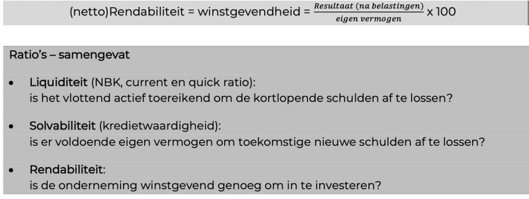
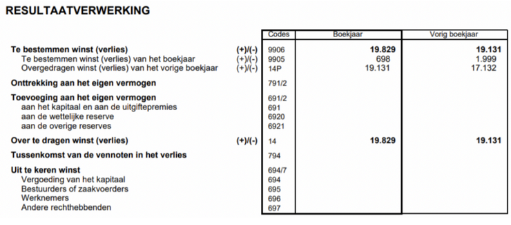
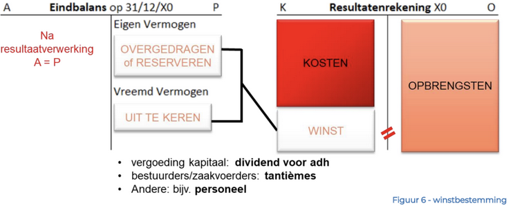
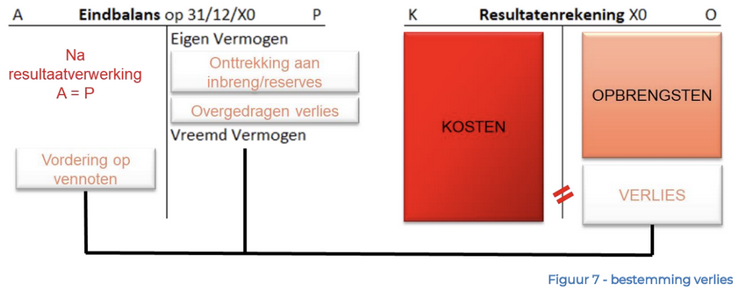
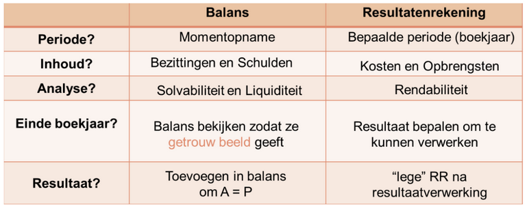
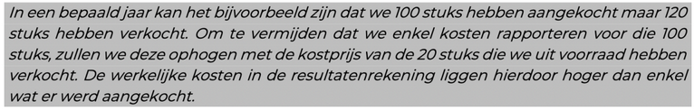
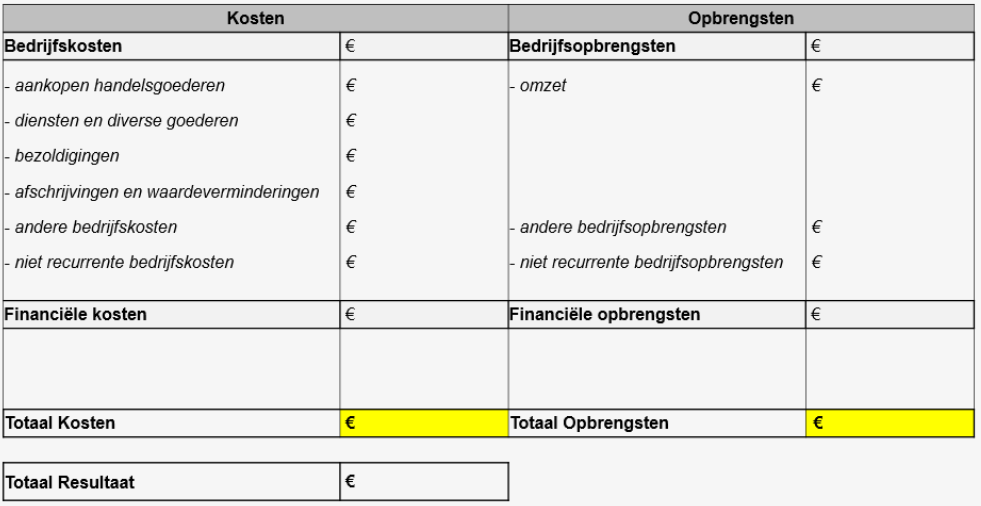

# H2 De Resultatenrekening

## **2.1 Opbouw van de resultatenrekening**

De resultatenrekening richt zich op de core-business van de onderneming, waarbij het eindresultaat winst of verlies is.

### Belangrijke punten

- 💡 **Opbrengsten zijn niet altijd ontvangsten**: Opbrengsten betreffen bijvoorbeeld facturen die nog niet betaald zijn.
- **Courante opbrengsten en kosten**: Het verschil tussen beide vormt het bedrijfsresultaat.
- **Resultaat vóór belasting**:  
  - Winst: Belastingen betalen.  
  - Verlies: Geen belasting verschuldigd.
- **Te bestemmen resultaat (na belasting)**:  
  Dit wordt verwerkt binnen zes maanden na het afsluiten van het boekjaar tijdens een Algemene Vergadering (AV).

### Aandachtspunten

- **Aandeelhouders**: Vinden liquiditeit de belangrijkste ratio.

- **Winstoverdracht**: Wordt toegevoegd aan het eigen vermogen, wat leidt tot een hogere solvabiliteit en een sterker financieel profiel.

💡 **De resultatenrekening geldt slechts voor één boekjaar** en wordt aan het einde van de periode gesaldeerd om in het nieuwe boekjaar vanaf nul te starten. Dit verschilt van de balans, die een momentopname kan zijn.

---

## **2.2 Brutomarge**

### **Formule**

_Brutomarge = Omzet - Cost of Goods Sold (COGS) - Diensten en Diverse Goederen._

De brutomarge geeft weer hoeveel waarde er overblijft van dagelijkse ondernemingsactiviteiten.

### **2.2.1 Omzet**

**Formule**:  
_Omzet = verkoopprijs per stuk (excl. btw) × afzet._  

Een hoge omzet leidt vaak tot een sterke cashpositie.

### **2.2.2 Handelsgoederen, grond- en hulpstoffen**

- **COGS**: De gerapporteerde kosten zijn afhankelijk van het aantal verkochte stuks.

### **2.2.3 Diensten en Diverse Goederen**

- **Indirecte kosten** die nodig zijn om de onderneming draaiende te houden:  
  Huur, energie, reclame, beheerskosten, etc.

---

## **2.3 Bezoldigingen, Afschrijvingen, en Andere Bedrijfskosten**

### **2.3.1 Bezoldigingen**

- Ruimer omschreven als personeelskosten.  
- De werkgever houdt de **RSZ** (Rijksdienst voor Sociale Zekerheid) en **bedrijfsvoorheffing** in op het brutoloon van werknemers en draagt deze over naar de bevoegde overheidsdienst.

### **2.3.2 Afschrijvingen**

- **Intern verantwoordingstuk**: De werkgever documenteert systematisch de waardedaling van investeringen als bedrijfskosten.

- **Boekwaarde**: Geeft de marktwaarde weer van een investering:  
  _Boekwaarde = Aanschafwaarde - Σ Afschrijvingen._

#### **Afschrijvingsregels**

- Levensduur van de investering bepaalt de afschrijvingen. Een restwaarde kan worden vastgelegd, maar dit is fiscaal minder interessant.
- Bij aanschaf midden in het jaar geldt pro-rata-afschrijving: slechts een deel van de jaarlijkse waarde kan worden ingebracht.
  
#### **Afschrijvingspercentages**

| Categorie                  | Percentage |
|----------------------------|------------|
| Kantoren en gebouwen       | 3%         |
| Industriële gebouwen       | 5%         |
| Meubilair en machines      | 10-20%     |
| Voertuigen                 | 20%        |
| Klein materiaal            | 33%        |

### Uitzonderingen

- **Niet afschrijfbaar**:  
  - Terreinen (behalve bij waardevermindering zoals bodemproblemen).
- **Wel afschrijfbaar**:  
  - Goodwill: Meestal over 5 jaar.
  - Oprichtingskosten: Meestal over 5 jaar.

---

### **2.3.3 Andere Bedrijfskosten**

- **Belastingen**:  
  - Onroerende voorheffing (gronden, huizen).  
  - Belastingen op voertuigen.  
  - Accijnzen.  

**Opmerking**: Belastingen op resultaat (personen- of vennootschapsbelasting) worden niet beschouwd als bedrijfskosten.

- **Niet-aftrekbare kosten**: Privé-investeringen of andere uitgaven worden hier geboekt.  
- **BTW**: Wordt als een neutrale transactie beschouwd.

## sjabloon resultatenrekening

---
