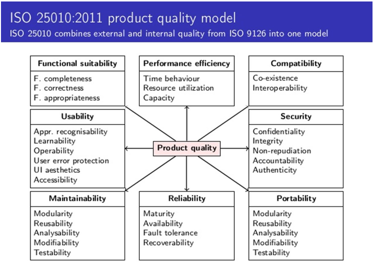

# H03: Niet-Functionele Requirements

## 1. Inleiding

In een vorig hoofdstuk hebben we de **functionele requirements** aan de hand van use cases vastgelegd. In dit hoofdstuk zullen we onderzoeken hoe we de niet-functionele requirements (NFR) eenduidig kunnen beschrijven in een vast kader. Hiervoor gebruiken we een **S.M.A.R.T. template**.

Elk systeem wordt ontwikkeld om een bepaalde reden, en de eisen voor het nieuwe systeem moeten vooraf helder en eenduidig worden geformuleerd. Dit gebeurt in een **business case**, zodat we een handig overzicht hebben van de behoeften die de stakeholders wensen in het nieuwe systeem. Afhankelijk van de rol van de stakeholder binnen het project zullen zijn of haar behoeften verschillen. De business case bevat dus een overzicht van de uiteenlopende behoeften van alle rollen.

Een **requirement** is een eis aan het systeem. Het kan bijvoorbeeld zijn dat we een bepaald gedrag willen afdwingen of dat het systeem aan een bepaalde kwaliteit moet voldoen. Om te kunnen verifiëren of deze eisen op het einde voldaan zijn, stellen we kritische succesfactoren (KSF) op. Vervolgens formuleren we de meetbare acceptatiecriteria bij elke KSF, zodat we objectief kunnen evalueren of de KSF bij een requirement bereikt is.

## 2. Soorten Niet-Functionele Requirements

Alvorens de niet-functionele requirements vast te leggen, bespreken we de verschillende soorten niet-functionele requirements op basis van de **ISO 25010:2011**-standaard, die 8 hoofdsoorten definieert:

- **Functional suitability** (functionele geschiktheid)
- **Performance efficiency** (prestatie-efficiëntie)
- **Compatibility** (uitwisselbaarheid)
- **Usability** (bruikbaarheid)
- **Security** (beveiligbaarheid)
- **Maintainability** (onderhoudbaarheid)
- **Reliability** (betrouwbaarheid)
- **Portability** (overdraagbaarheid)

Voorbeelden en subcategorieën van elk type kunnen in de lesstof worden geraadpleegd. Hoewel je deze categorieën niet uit het hoofd hoeft te kennen, moet je weten hoe je ze kunt testen.

## 3. Niet-Functionele Requirements (NFR)

### 3.1 Inleiding

Om een NFR vast te leggen als een testbaar gegeven, maken we gebruik van een **S.M.A.R.T. template**:

- **Specifiek**
- **Meetbaar**
- **Acceptabel**
- **Realistisch**
- **Tijdsgebonden**

### 3.2 Template

Het template voor NFR’s is als volgt opgebouwd:

| Element         | Beschrijving                                                                                      |
|-----------------|--------------------------------------------------------------------------------------------------|
| **Categorie**   | De naam van de NFR, zo specifiek mogelijk benoemd op basis van de ISO-norm.                       |
| **Indicator**   | De specifieke subcategorie binnen de gekozen hoofdsoort van de NFR.                               |
| **Meetvoorschrift** | De stappen en scenario’s die gevolgd moeten worden bij het uitvoeren van de NFR.             |
| **Norm**        | De verwachte resultaten die behaald moeten worden om de NFR als geslaagd te beschouwen.           |

#### 3.2.1 Categorie

Hier wordt zo specifiek mogelijk, op basis van de **ISO-norm**, de hoofdsoort van de NFR vermeld die zal worden getest.

#### 3.2.2 Indicator

De **indicator** beschrijft de specifieke subcategorie, gebaseerd op de gekozen hoofdcategorie, die met deze NFR getest wordt.

#### 3.2.3 Meetvoorschrift

Bij het **meetvoorschrift** beschrijf je specifiek alle stappen die nodig zijn voor het uitvoeren van de NFR. Dit omvat het volledige testscenario, waarin vermeld staat welke personen de test uitvoeren en welke stappen en acties doorlopen worden.

#### 3.2.4 Norm

In de **norm** wordt beschreven welke resultaten we verwachten en waaraan deze moeten voldoen. De norm bepaalt wanneer de NFR als geslaagd beschouwd kan worden.

### 3.3 S.M.A.R.T

#### 3.3.1 Specifiek

Met **specifiek** willen we vooral een antwoord beschrijven op de vraag *“Wat wil ik bereiken?”*. Het moet duidelijk omschreven zijn wie welke acties uitvoert en hoe deze precies uitgevoerd worden.

#### 3.3.2 Meetbaar

Het criterium **meetbaar** wordt bereikt als we precies weten waaraan we kunnen merken of het resultaat behaald is. Met andere woorden, we moeten de norm eenduidig kunnen toetsen en de meetresultaten evalueren om te controleren of het doel bereikt is.

#### 3.3.3 Acceptabel

Uit het template moet duidelijk blijken waarom we deze doelstelling willen bereiken. De NFR moet dus voldoende zijn afgetoetst om door alle partijen als behaald te worden beschouwd indien aan de norm wordt voldaan.

#### 3.3.4 Realistisch

Het criterium van **realistisch** bestaat uit twee delen. Enerzijds moet het meetvoorschrift relevant zijn, wat betekent dat de norm haalbare acties bevat die effectief op eenzelfde manier uitgevoerd kunnen worden en bijdragen aan de business value. Anderzijds moet het geheel realistisch zijn: de NFR mag niet te groot zijn en moet een duidelijk afgebakend scenario testen.

#### 3.3.5 Tijdsgebonden

De NFR moet ook **tijdsgebonden** zijn; dit betekent dat er een duidelijk begin- en eindmoment is voor de test. Het is niet noodzakelijk dat dit in exacte tijdseenheden wordt vastgelegd, maar de periode waarin de NFR uitgevoerd moet worden, moet eenduidig vaststaan.
